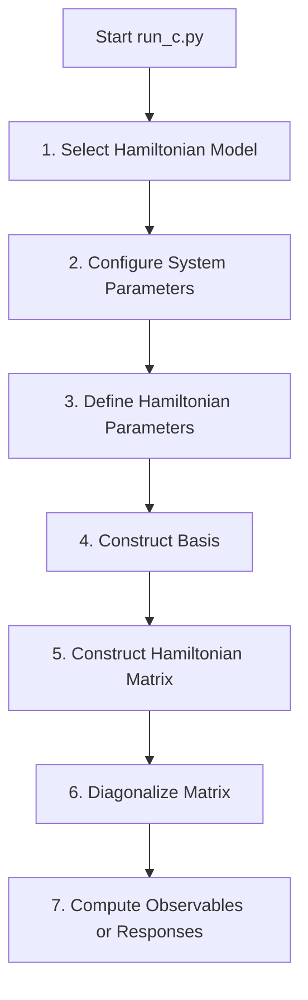

# Documentation of Semi Emperical Hamiltonian Model for Conjugated Systems Codebase

<!-- DOCUMENTATION VERSION: 1.0.0 -->
<!-- Feel free to update, reorder, or append sections as needed. Extension hooks are marked using comments. -->

## 1. Overview

This codebase is a Python framework designed for quantum chemistry calculations of finite conjugated systems. It utilizes many-body Fock-space representations under the second quantization formalism, allowing for the configuration, construction, and exact diagonalization of semi-empirical Hamiltonian models.

### Hamiltonian Models
The codebase supports the following Hamiltonian models:
* **Hückel Model:** Tight-binding model accounting only for site-specific on-site energies ($\alpha_i$) and nearest-neighbor hopping parameters ($\beta$).
* **Hubbard Model:** Incorporates on-site electron-electron repulsion ($U$) to account for Coulombic cost on doubly-occupied spatial sites.
* **Extended Hubbard Model:** Adds nearest-neighbor Coulomb repulsion ($V_{ij}$) parameterized using distance-dependent Ohno or Mataga-Nishimoto (MN) potentials.
* **PPP (Pariser-Parr-Pople) Model:** Adds long-range Coulomb repulsion ($V_{ij}$) between all pairs of spatial sites, parameterized using Ohno or MN potentials.

### Observables & Properties
For any calculated state (including the ground state and excited states), the codebase can compute:
* **Energy Eigenvalues and Eigenstates (Eigenvectors)**
* **Double Occupancy:** Average number of doubly-occupied spatial sites.
* **Dipole Moment:** Longitudinal dipole moment components ($\mu_x$, $\mu_y$).
* **Electron Density:** Local charge density $\langle n_i \rangle$ at each spatial site.
* **Density-Density Correlation Matrix:** Charge-charge correlations between different spatial sites ($C_{ij} = \langle n_i n_j \rangle - \langle n_i \rangle \langle n_j \rangle$).
* **Finite Field Responses:** Polarizability ($\alpha$), first hyperpolarizability ($\beta$), and second hyperpolarizability ($\gamma$) computed via:
  * **Sum Over States (SOS)** Rayleigh - Schrodinger perturbation theory.
  * **Finite Difference** Stark-shift re-diagonalization.
  * **Perturbed State Properties:** Evaluation of any of the above observables under arbitrary external static electric fields ($F_x$, $F_y$).

---

## 2. Directory Structure

The codebase is organized into modular directories tailored for specific functions. Below is a detailed description of each folder and file.

### Interface
This folder contains the files managing user interaction, session state tracking, and orchestration of the whole workflow of a calculation of session.

* **[Interface/session.py]**
  * *Functionality:* Declares and initializes the global session dictionary (`ses`). It acts as a central state manager tracking active model choices, system parameters (sites, electrons, boundary conditions, coordinates, distances), parameter values (hopping, repulsions), basis configurations, Hamiltonian matrix state, and calculated eigenpairs. Provides invalidation functions to reset dependent functionality if inputs from user change(System parameters, emperical parameters)
* **[Interface/run_c.py]**
  * *Functionality:* The main executable script that loads the session and launches the interactive menu loop. Guides users through system configuration, parameter input, diagonalization, and property evaluation.
* **[Interface/model_system.py]**
  * *Functionality:* Handles interactive input menus for selecting the Hamiltonian model and defining system characteristics (number of spin orbitals, electrons, periodic boundary conditions, uniformity, and coordinate loading for distance matrix calculations).
* **[Interface/par_hamiltonian.py]**
  * *Functionality:* Configures emperical parameters (alpha, beta, U, and Ohno/MN repulsion strings). Drives basis set construction, Hamiltonian matrix generation, and full or sparse (lowest-$k$) diagonalization.
* **[Interface/ob_fr.py]**
  * *Functionality:* Coordinates calculation of observables and finite-field responses. Allows running SOS calculations, Finite Difference calculations, and recursive Stark-shift calculations where observables are evaluated for a state under a custom field.

### Basis_operations
Contains the underlying algebraic machinery for basis set generation and second-quantization operations.

* **[Basis_operations/basis.py]**
  * *Functionality:* Generates the Fock-space basis set. Supports CIS, CISD, CISDT, and Full CI (FCI) basis generation. Features `binary_hash` which maps state lists to binary integer representations for rapid bitwise execution.
* **[Basis_operations/binary.py]**
  * *Functionality:* Implements second-quantization operators. Defines creation ($c^\dagger$), annihilation ($c$), and number operators ($n_i$, $n_{i\sigma}$) using bit-manipulation of binary integers representing occupations. Tracks fermion exchange phases.
* **[Basis_operations/com.py]**
  * *Functionality:* Provides an alternative Combinadic-Hash based basis set creation and indexing mechanism. through this Hash is not being used extensevily in this CodeBase due to relative performance with Binary-Hash
* **[Basis_operations/operators.py]**
  * *Functionality:* Computes expectation values ($\langle \psi | \hat{O} | \psi \rangle$) and transition matrix elements ($\langle \psi_a | \hat{O} | \psi_b \rangle$) for physical observables including double occupancy, dipole components, local density, and density-density correlations.

* **[SOS.py]**
  * *Functionality:* Implements the Sum Over States (SOS) formulas to calculate polarizability and hyperpolarizabilities from eigenvalues and transition dipole matrices.  

###  Hamiltonians
Handles many-body matrix construction for the respective physical models.

* **[Hamiltonians/huckel.py]**
  * *Functionality:* Generates the Hückel Hamiltonian matrix in the many-body basis.
* **[Hamiltonians/hubbard.py]**
  * *Functionality:* Generates the Hubbard Hamiltonian matrix. Serves as the provider of the core nearest-neighbor hopping function (`hopp`) and matrix phase checker (`dp`) reused by other models.
* **[Hamiltonians/ext_hubbard.py]**
  * *Functionality:* Generates the Extended Hubbard Hamiltonian matrix by incorporating nearest-neighbor Ohno/MN Coulomb repulsion.
* **[Hamiltonians/ppp.py]**
  * *Functionality:* Generates the PPP Hamiltonian matrix by incorporating long-range Ohno/MN Coulomb repulsion between all spatial site pairs.

### Huckel
A dedicated folder for the single-particle analytical solution of the Hückel model.

* **[Huckel/huckel_main.py]**
  * *Functionality:* Standalone execution script to analytically solve open chains and closed rings, compute the HOMO-LUMO energy gap, and trigger molecular orbital visualizations.
* **[Huckel/visualization.py]**
  * *Functionality:* Visualizes energy level spectra and maps MO coefficients as colored lobes (representing phases) on 2D coordinates using Matplotlib.

### Other Root Files
* **[requirements.txt]**
  * *Functionality:* Lists the Python package dependencies (e.g. numpy, scipy, matplotlib).

<!-- EXTENSION POINT: Add new file references here -->

---

## 3. Workflow

The codebase supports two distinct operational workflows.  
First the main workflow for many-Body CI calculation and a standalone workflow for analytical calculation using Huckel Hamiltonian which provides capability to visualize the eigenpairs

### Workflow A: Many-Body CI Calculations (via run_c.py)

1. **Model Selection:** The user selects Huckel, Hubbard, Extended Hubbard, or PPP.
2. **System Configuration:** User inputs spin orbitals ($N$) and electrons ($K$). They choose Open vs. Closed boundary conditions, Uniformity, and optionally load 2D spatial coordinates. 
3. **Parameterization:** Values for on-site energy ($\alpha$), hopping ($\beta$), on-site repulsion ($U$), and long-range parameterizations (Ohno vs. MN) are assigned.
4. **Basis Construction:** The many-body Fock-space states are generated and hashed into integers using bit representations.
5. **Hamiltonian Assembly:** The matrix is constructed by evaluating hopping and Coulomb repulsion terms in the Fock basis.
6. **Diagonalization:** The matrix is diagonalized using standard dense methods (numpy.linalg.eigh) or sparse iteration (scipy.sparse.linalg.eigsh) to obtain eigenvalues and eigenvectors.
7. **Property Evaluation:** The calculated states are passed to compute observables or field responses (SOS or Finite Difference).

---

### Workflow B: Standalone Analytical Hückel Calculations (via huckel_main.py)

1. **Input Setup:** The user runs `huckel_main.py` directly and inputs the number of atoms ($N$) and chain geometry (Open Chain vs. Closed Ring).
2. **Analytical Evaluation:** The script computes energy levels and coefficients using exact analytical formulas:
   * Open Chain: $E_j = 2\beta \cos\left(\frac{j \pi}{N+1}\right)$
   * Closed Ring: $E_k = 2\beta \cos\left(\frac{2 \pi k}{N}\right)$
3. **GAP and Visualization:** The HOMO-LUMO gap is printed, and the user can request orbital mapping. If requested, a plot of energy levels and MO shapes is generated and saved as a PNG.

---

The Markdown file **[par_units.md]** contains the units and conventions used in this codebase and provides standard parameters to run calculations 

<!-- EXTENSION POINT: Add further customization instructions, troubleshooting guides or notes below -->
